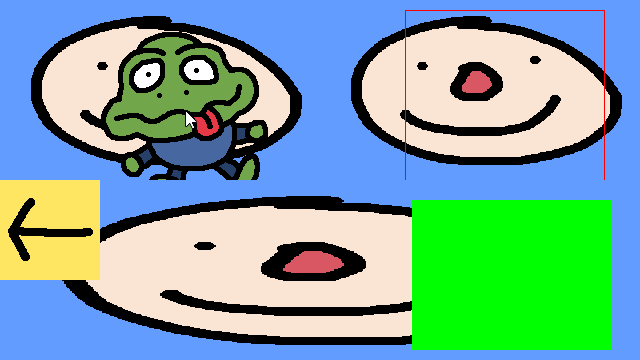

# SDL2 Notes

A little SDL2 project to be used as a reference.

Most of this code was from following [Lazy Foo's tutorial](https://lazyfoo.net/tutorials/SDL/).

# Build

Open `x64 Native Tools Command Prompt for VS 2022` and native to the project.

Run `.\build.bat` to build a binary to `.\bin\game.exe`.
